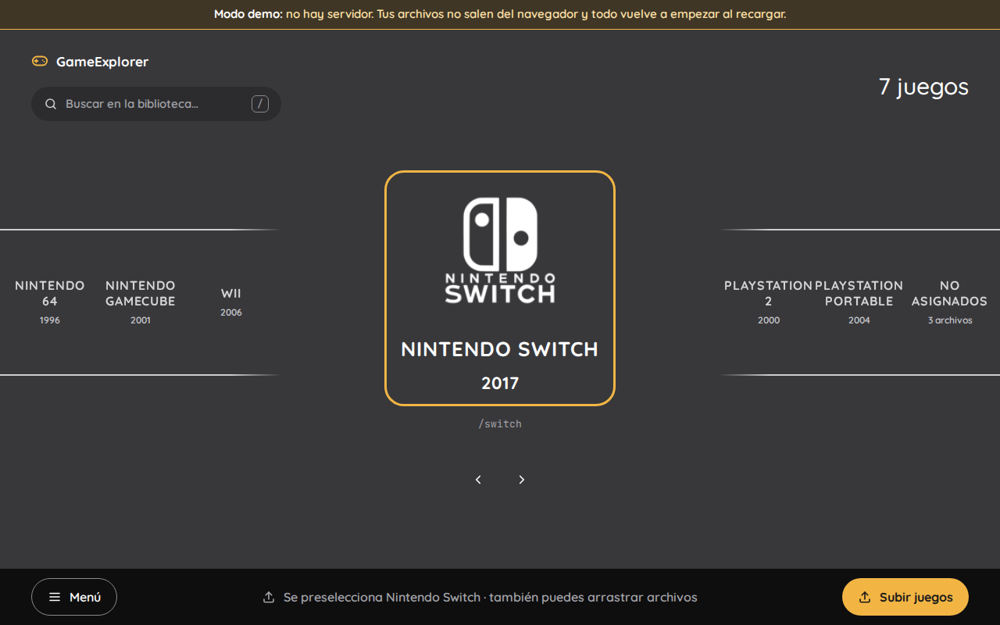
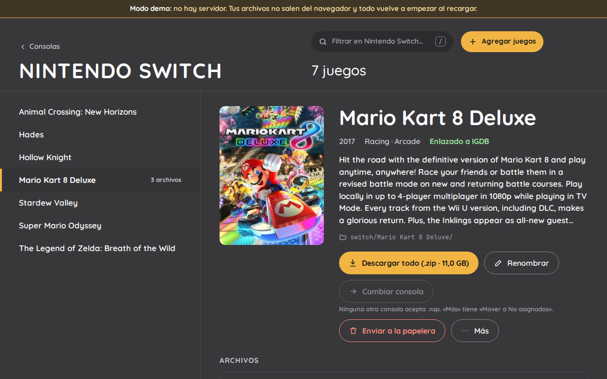
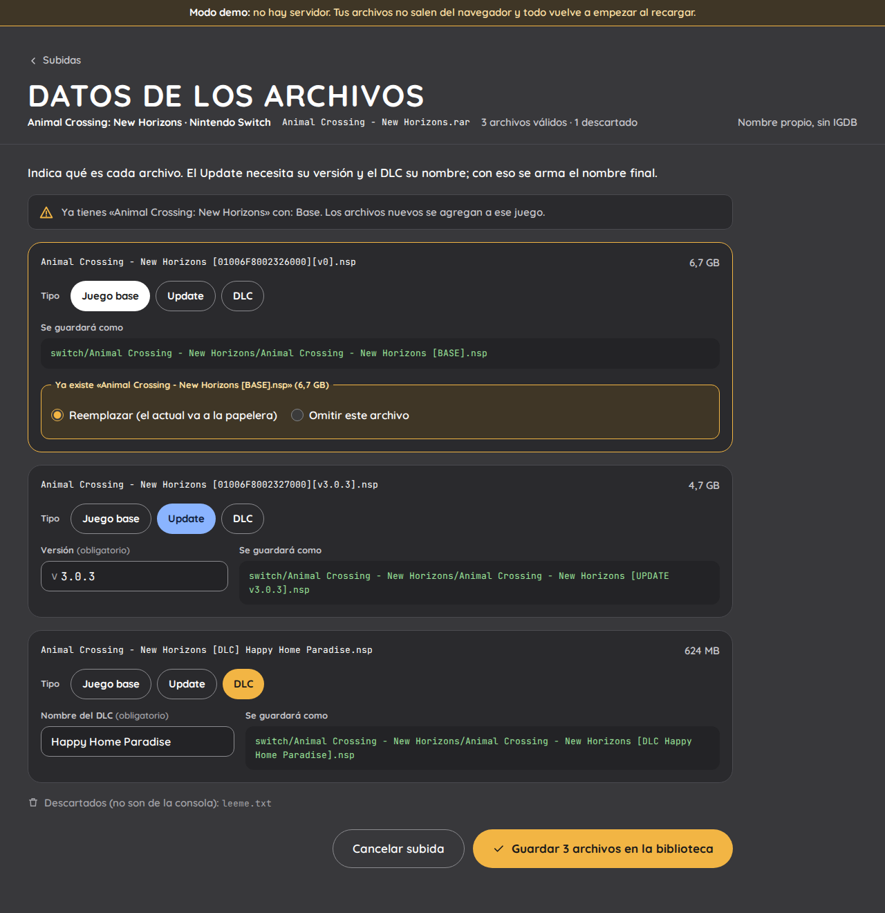
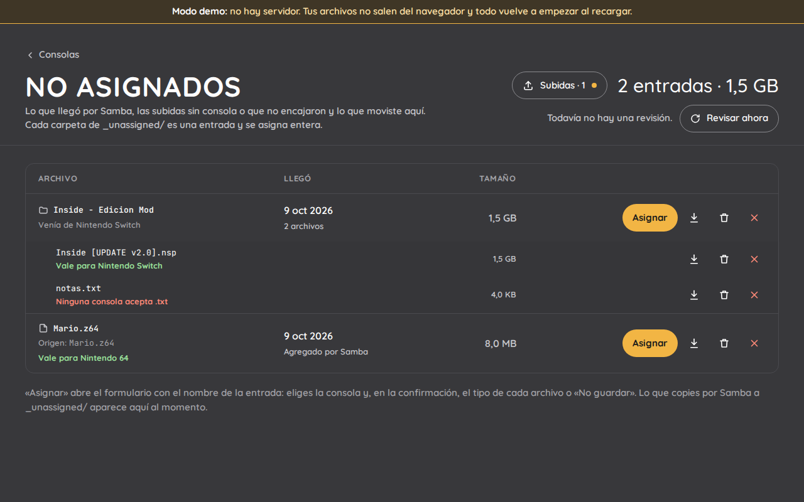
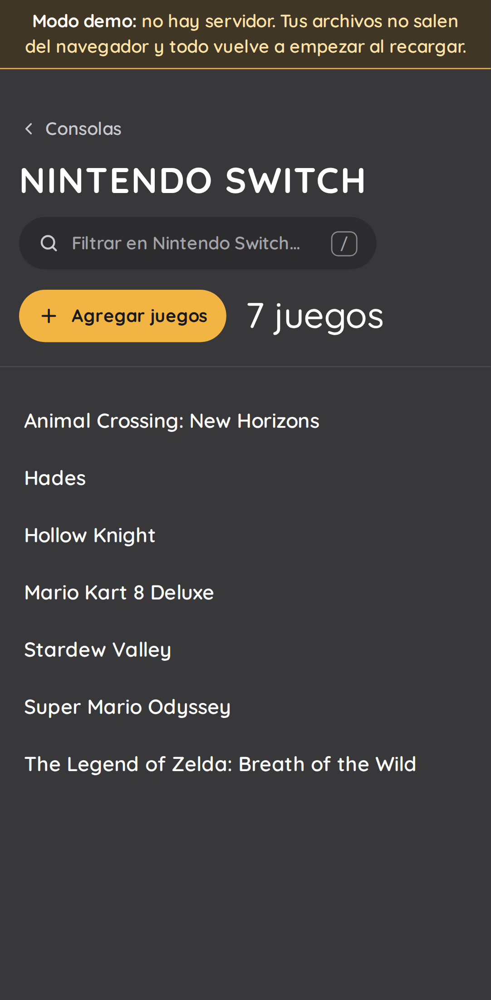
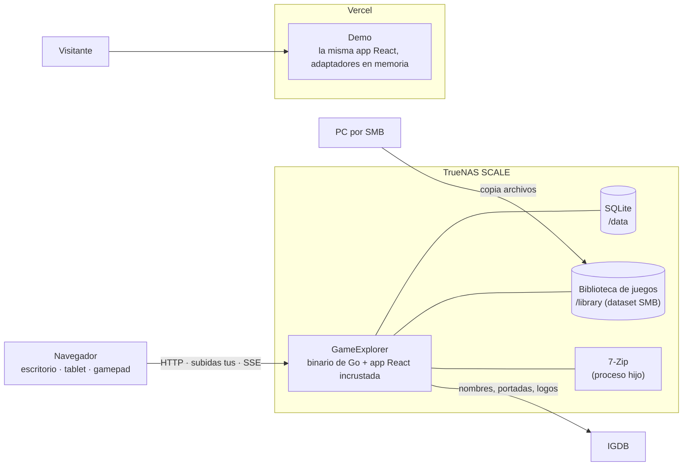
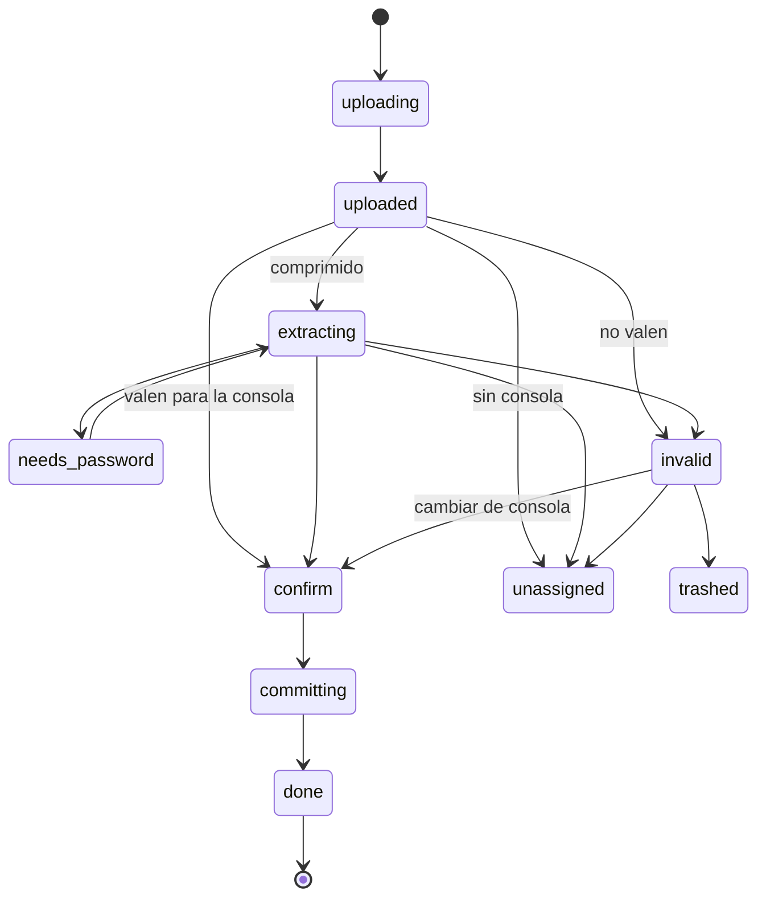

# GameExplorer

[English](README.md) · **[Demo en vivo](https://game-explorer-gold.vercel.app/)**

App web autoalojada para un NAS doméstico (TrueNAS SCALE) que permite **subir, descomprimir, clasificar, renombrar, explorar y descargar juegos de emulación** desde cualquier navegador: escritorio, tablet, pantalla táctil o gamepad. La interfaz está inspirada en EmulationStation.


Arrastra un `.rar`, `.zip`, `.7z` o el archivo del juego, indica qué juego y consola es (IGDB sugiere nombres, pero sirve cualquiera) y GameExplorer lo descomprime, comprueba que los archivos valgan para la consola y los guarda como `[consola]/[juego]/[archivo]` con nombres consistentes que reconocen los frontends al estilo EmulationStation.

> **Pruébala sin NAS:** la [demo](https://game-explorer-gold.vercel.app/) usa la misma interfaz con adaptadores en el navegador. Sin servidor ni login, y tus archivos no salen del navegador; los archivos de ejemplo recorren todos los casos.

## Características

- **Seis consolas**, cada una un módulo definido en código ([agregar otra](docs/adding-a-console.md) no toca nada más): Nintendo 64, GameCube, Wii, Switch, PlayStation 2 y PSP.
  - Switch: juego base, updates y DLC (`Juego [BASE].nsp`, `Juego [UPDATE v1.0.3].nsp`, `Juego [DLC Nombre].nsp`).
  - GameCube y PS2: juegos de varios discos (`Juego (Disc 1).iso`, `Juego (Disc 2).iso`).
  - Nintendo 64, Wii y PSP: un archivo por juego.
- **Subidas de decenas de gigabytes**, reanudables (protocolo tus) y escritas a disco en streaming; los comprimidos se descomprimen con 7-Zip, también los protegidos con contraseña, y se verifican contra su CRC.
- **Los duplicados se detectan antes de escribir nada**: reemplazar (el anterior va a la papelera) u omitir. Cada cambio en la biblioteca queda en un journal y se deshace si falla a mitad.
- **Pensada para Samba**: lo que copies por el recurso compartido se detecta. Lo desconocido va a la sección **No asignados**, agrupado por carpeta, para asignarlo después a una consola; también se puede subir directamente ahí.
- Editar, renombrar, mover entre consolas, papelera con restauración, búsqueda, descargas con HTTP Range o el juego completo en zip.
- Táctil, teclado y gamepad; español e inglés.
- Un solo binario de Go con la app de React incrustada, desplegado como Custom App de TrueNAS.

## Capturas

| | |
|---|---|
|  |  |
|  |  |

<p align="center"></p>

Las capturas y el GIF se generan desde la demo con `task screenshots`.

## Arquitectura



Una subida es un trabajo que sigue esta máquina de estados (spec RF-03 a RF-13):



| | |
|---|---|
| Backend | Go, `net/http`, tusd, SQLite (modernc + sqlc + goose), 7-Zip |
| Frontend | React, Vite, TypeScript, Tailwind, TanStack Router/Query, tus-js-client |
| Contrato | OpenAPI 3, spec-first: el servidor de Go y el cliente TS se generan |
| Diseño | Domain-Driven Design en los dos lados (catalog, ingestion, metadata, identity), puertos y adaptadores; Go y TypeScript comparten vectores dorados para los nombres de archivo |
| Calidad | Tests de Go y Vitest, E2E con Playwright en escritorio, tablet y móvil, golangci-lint, ESLint estricto, govulncheck en CI |

Los requisitos están en [`docs/spec.md`](docs/spec.md) y el registro de trabajo en [`docs/tasks.md`](docs/tasks.md).

## Instalar en TrueNAS SCALE

La imagen se publica en GHCR con cada versión (`ghcr.io/carlossv923/gameexplorer`). Se instala como Custom App con [`deploy/truenas/compose.yaml`](deploy/truenas/compose.yaml); la [guía](deploy/truenas/README.md) explica los datasets, los permisos y la configuración de SMB.

## Desarrollo

Requisitos: Docker, Node 24+, pnpm y [Task](https://taskfile.dev). Las herramientas de Go (tests, lint, generación de código, build) corren en Docker, así que no hace falta Go instalado.

```bash
task install
task dev:api       # API de Go en Docker, http://localhost:8080 (contraseña de desarrollo: gameexplorer)
task dev:web       # http://localhost:5173 (hace de proxy de /api)
task dev:demo      # solo el frontend, con el backend simulado
task gen           # regenera el código tras editar api/openapi.yaml o las consultas SQL
task check         # lint + tests + build, igual que la CI
task e2e           # Playwright sobre el build de la demo (escritorio, tablet, móvil)
task screenshots   # capturas y GIF del README
```

La configuración va en variables de entorno. Ver [`.env.example`](.env.example).

## Aviso legal

GameExplorer no incluye, descarga ni distribuye juegos. Úsalo solo con archivos que tengas derecho a conservar. Los datos, portadas y logos de los juegos los proporciona [IGDB](https://www.igdb.com).

Licencia [MIT](LICENSE).
