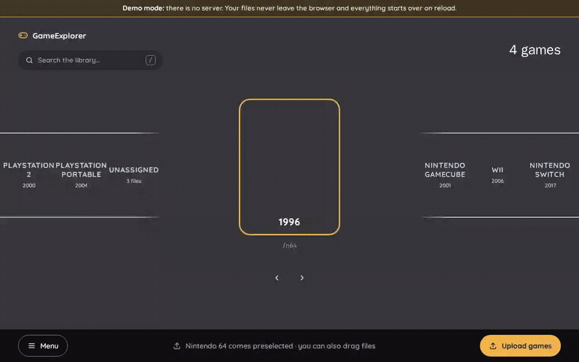
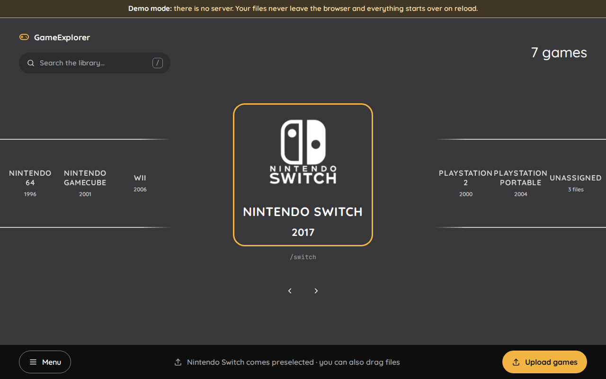
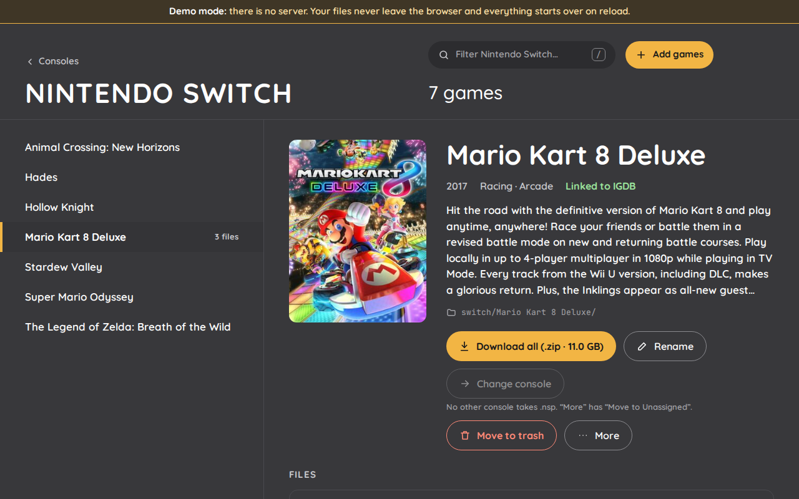
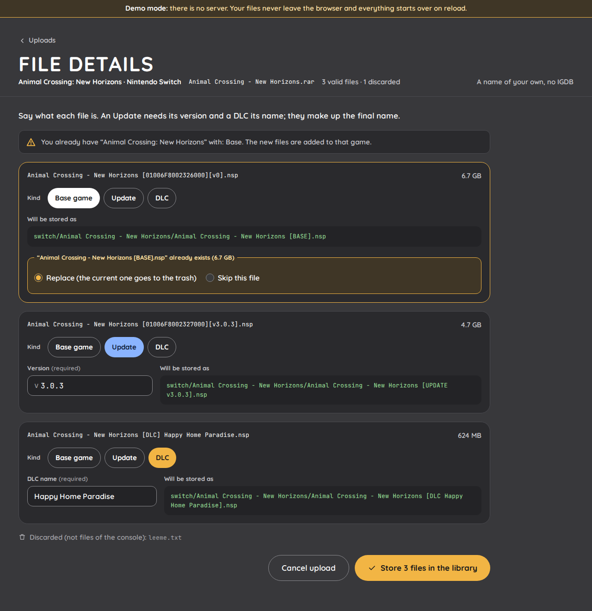
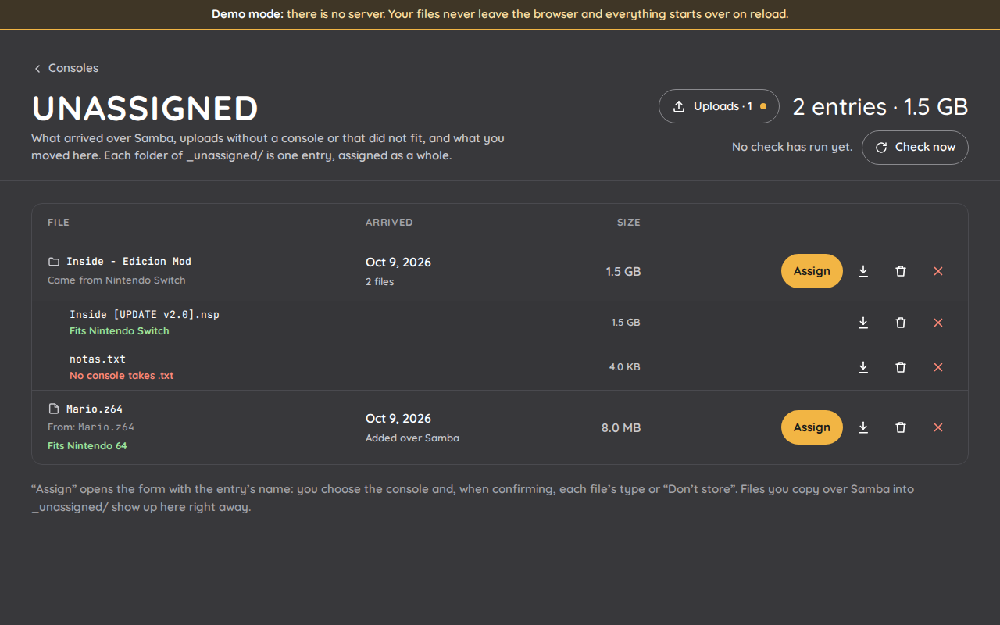
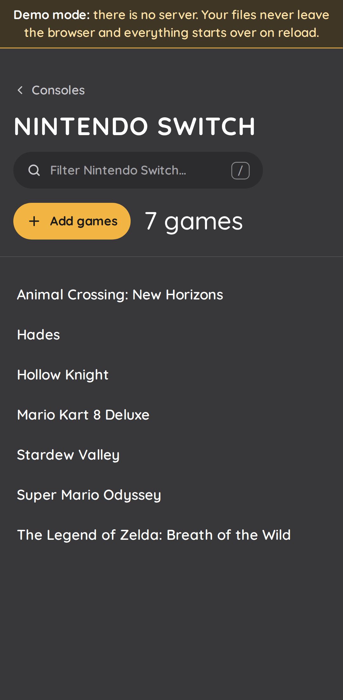
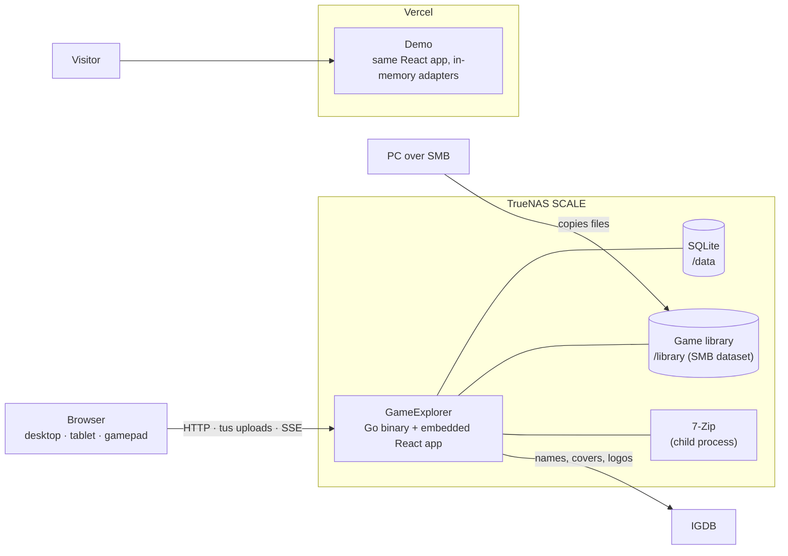
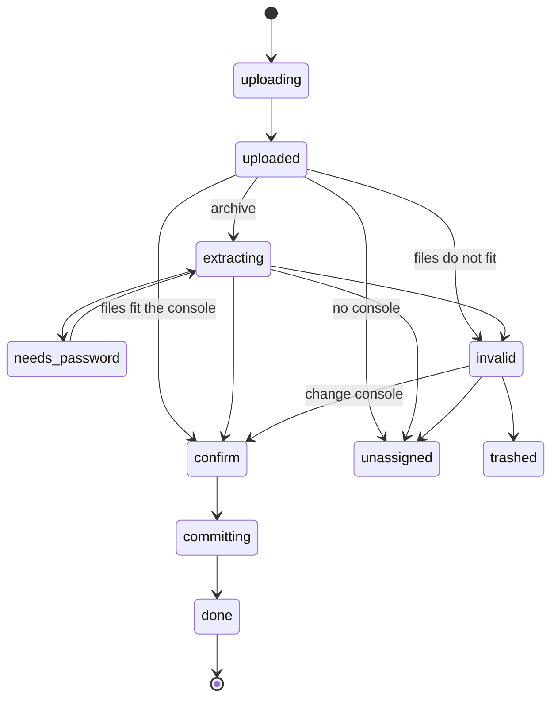

# GameExplorer

[Español](README.es.md) · **[Live demo](https://game-explorer-gold.vercel.app/)**

Self-hosted web app for a home NAS (TrueNAS SCALE) to **upload, extract, classify, rename, browse and download emulation game files** from any browser: desktop, tablet, touch screen or gamepad. The UI is inspired by EmulationStation.



Drop a `.rar`, `.zip`, `.7z` or a raw game file, say which game and console it is (IGDB suggests names, but any name works), and GameExplorer extracts it, checks the files fit the console and stores them as `[console]/[game]/[file]` with consistent names that EmulationStation-style frontends recognize.

> **Try it without a NAS:** the [demo](https://game-explorer-gold.vercel.app/) runs the same UI with in-browser adapters. No server, no sign-in, and your files never leave the browser; sample files walk through every case.

## Features

- **Six consoles**, each a module defined in code ([adding one](docs/adding-a-console.md) touches nothing else): Nintendo 64, GameCube, Wii, Switch, PlayStation 2 and PSP.
  - Switch: base game, updates and DLC (`Game [BASE].nsp`, `Game [UPDATE v1.0.3].nsp`, `Game [DLC Name].nsp`).
  - GameCube and PS2: games of several discs (`Game (Disc 1).iso`, `Game (Disc 2).iso`).
  - Nintendo 64, Wii and PSP: one file per game.
- **Uploads of tens of gigabytes**, resumable (tus protocol) and streamed to disk; archives are extracted with 7-Zip, password-protected ones included, and verified against their CRC.
- **Duplicates are caught before anything is written**: replace (the old file goes to the trash) or skip. Every library change is journaled and undone if it fails half-way.
- **Samba-friendly**: files copied over the share are picked up. Unknown ones land in an **Unassigned** section, grouped by folder, to be assigned to a console later; uploads can go there too.
- Edit, rename, move between consoles, trash with restore, search, downloads with HTTP Range or the whole game as a zip.
- Touch, keyboard and gamepad all work; Spanish and English.
- A single Go binary with the React app embedded, deployed as a TrueNAS custom app.

## Screenshots

| | |
|---|---|
|  |  |
|  |  |

<p align="center"></p>

Screenshots and GIF are generated from the demo with `task screenshots`.

## Architecture



An upload is a job that follows this state machine (spec RF-03 to RF-13):



| | |
|---|---|
| Backend | Go, `net/http`, tusd, SQLite (modernc + sqlc + goose), 7-Zip |
| Frontend | React, Vite, TypeScript, Tailwind, TanStack Router/Query, tus-js-client |
| Contract | OpenAPI 3, spec-first: the Go server and the TS client are generated |
| Design | Domain-Driven Design on both sides (catalog, ingestion, metadata, identity), ports and adapters; Go and TypeScript share golden test vectors for file naming |
| Quality | Go and Vitest tests, Playwright E2E on desktop, tablet and phone, golangci-lint, ESLint strict, govulncheck in CI |

The requirements are in [`docs/spec.md`](docs/spec.md) and the work log in [`docs/tasks.md`](docs/tasks.md).

## Install on TrueNAS SCALE

The image is published to GHCR with every release (`ghcr.io/carlossv923/gameexplorer`). Install it as a custom app with [`deploy/truenas/compose.yaml`](deploy/truenas/compose.yaml); the [guide](deploy/truenas/README.md) covers the datasets, permissions and SMB settings.

## Development

Requirements: Docker, Node 24+, pnpm and [Task](https://taskfile.dev). Go tooling (tests, lint, code generation, build) runs in Docker, so a local Go install is optional.

```bash
task install
task dev:api       # Go API in Docker, http://localhost:8080 (dev password: gameexplorer)
task dev:web       # http://localhost:5173 (proxies /api)
task dev:demo      # frontend only, simulated backend
task gen           # regenerate code after editing api/openapi.yaml or SQL queries
task check         # lint + test + build, same as CI
task e2e           # Playwright on the demo build (desktop, tablet, phone)
task screenshots   # README screenshots and GIF
```

Configuration lives in environment variables. See [`.env.example`](.env.example).

## Legal

GameExplorer does not include, download or distribute games. Use it only with files you are entitled to keep. Game metadata, covers and logos are provided by [IGDB](https://www.igdb.com).

Licensed under the [MIT License](LICENSE).
